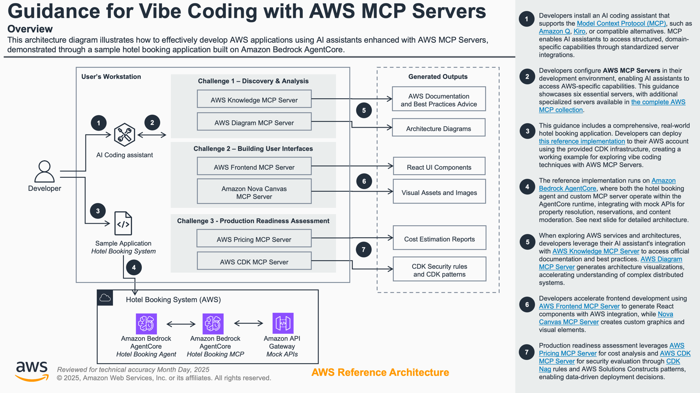
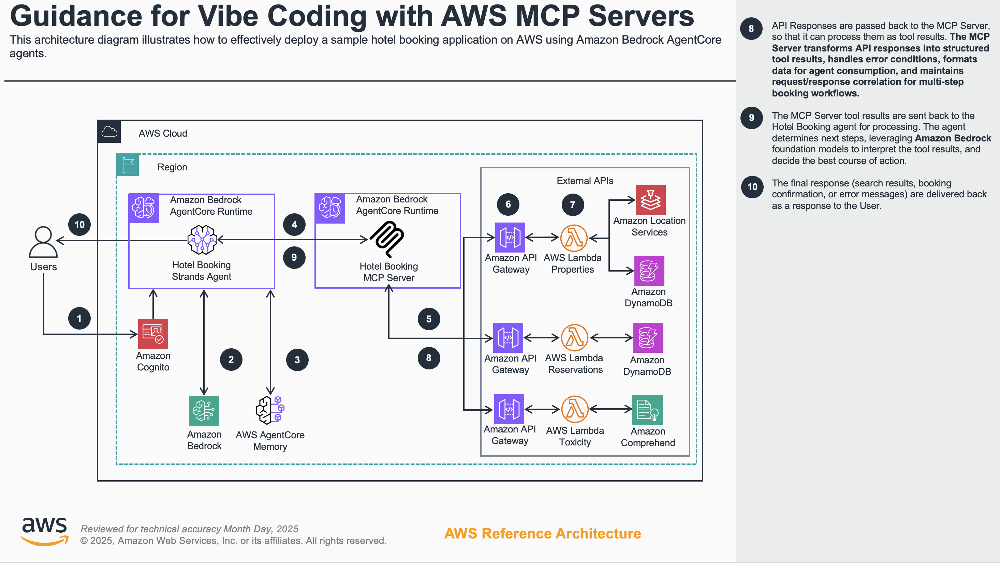

# Guidance for Vibe Coding AI Agents with AWS MCP Servers

## Table of Contents

- [Guidance for Vibe Coding AI Agents with AWS MCP Servers](#guidance-for-vibe-coding-ai-agents-with-aws-mcp-servers)
  - [Table of Contents](#table-of-contents)
  - [Overview](#overview)
    - [AWS MCP Servers](#aws-mcp-servers)
    - [Architecture (In Review)](#architecture-in-review)
    - [Cost](#cost)
    - [Sample Cost Table](#sample-cost-table)
  - [Deployment Options](#deployment-options)
    - [Option 1: AWS Workshop Studio (Recommended for Workshop Participants)](#option-1-aws-workshop-studio-recommended-for-workshop-participants)
    - [Option 2: Self-Deployment in Your Own AWS Account](#option-2-self-deployment-in-your-own-aws-account)
  - [Repository Structure](#repository-structure)
    - [System Components](#system-components)
  - [Prerequisites](#prerequisites)
    - [Workshop Studio Users](#workshop-studio-users)
    - [Self-Deployment Users](#self-deployment-users)
    - [Operating System](#operating-system)
  - [Deployment Steps](#deployment-steps)
    - [Step 1: Clone the Repository](#step-1-clone-the-repository)
    - [Step 2: Install Dependencies and Start Workshop Documentation](#step-2-install-dependencies-and-start-workshop-documentation)
  - [Deployment Validation](#deployment-validation)
  - [Running the Guidance](#running-the-guidance)
  - [Next Steps](#next-steps)
  - [Cleanup](#cleanup)
  - [FAQ and Known Issues](#faq-and-known-issues)
  - [Notices](#notices)
  - [Authors](#authors)

## Overview

This Guidance demonstrates how to build AI-powered development workflows using Amazon Bedrock AgentCore and the Model Context Protocol (MCP). It provides a complete, deployable hotel booking agent system that showcases "vibe coding" techniques - an AI-assisted development approach that accelerates software development through intelligent code generation, discovery, and problem-solving.

The Guidance is designed as an interactive workshop where participants learn to:

- Use AI tools to understand and navigate complex codebases quickly
- Generate, enhance, and debug code efficiently with AI assistance
- Leverage AI for architecture analysis, optimization, and testing
- Rapidly prototype and iterate on ideas using AI-powered development tools

Participants deploy a realistic hotel booking agent using Amazon Bedrock AgentCore and gain hands-on experience with AI development tools including Kiro, Amazon Q, and AWS MCP Servers. The skills learned can be immediately applied to production projects and shared across development teams.

### AWS MCP Servers

This workshop leverages [AWS MCP Servers](https://github.com/awslabs/mcp), specialized MCP servers that enhance foundation model capabilities through the Model Context Protocol (MCP). MCP is an open protocol that enables seamless integration between LLM applications and external data sources and tools.

The workshop demonstrates these capabilities across three practical scenarios:

- **Discovery & Analysis**: Automated architecture visualization and service expertise
- **Frontend Development**: Modern React applications with AWS Amplify integration
- **Production Readiness**: Real-time cost analysis and security assessment

### Architecture (In Review)

The solution implements a multi-tier architecture combining Amazon Bedrock AgentCore with serverless AWS services:





**Architecture Flow:**

- **User Interaction** - Users interact with the AgentCore agent through natural language conversations
- **Agent Orchestration** - Amazon Bedrock AgentCore processes requests and determines required actions
- **MCP Server Bridge** - Model Context Protocol server translates agent actions into API calls
- **Backend Services** - Three specialized APIs handle hotel search, reservations, and content moderation
- **Data Storage** - Amazon DynamoDB stores hotel and reservation data

**Key Components:**

- **Amazon Bedrock AgentCore** - Intelligent conversational agent with natural language understanding
- **MCP Server** (AWS Lambda) - Protocol bridge connecting agent to backend APIs
- **Property Resolution API** (AWS Lambda + API Gateway) - Hotel search powered by Amazon Location Service
- **Reservations API** (AWS Lambda + API Gateway) - Booking management and CRUD operations
- **Toxicity Detection API** (AWS Lambda + API Gateway) - Content moderation using Amazon Comprehend
- **Amazon DynamoDB** - NoSQL database for hotels and reservations

### Cost

You are responsible for the cost of the AWS services used while running this Guidance. As of October 2025, the cost for running this Guidance with the default settings in the US West (Oregon) Region is estimated at approximately **$258 per month** for continuous 24/7 operation.

**Note:** This estimate assumes continuous 24/7 usage with a moderately active workload. Actual costs will vary based on your specific usage patterns, interaction frequency, and data volumes.

We recommend creating a [Budget](https://docs.aws.amazon.com/cost-management/latest/userguide/budgets-managing-costs.html) through [AWS Cost Explorer](https://aws.amazon.com/aws-cost-management/aws-cost-explorer/) to help manage costs. Prices are subject to change. For full details, refer to the pricing webpage for each AWS service used in this Guidance.

### Sample Cost Table

The following table provides a sample cost breakdown for deploying this Guidance with the default parameters in the US West (Oregon) Region.

| AWS Service              | Purpose                            | Monthly Cost | Note                                                      |
| ------------------------ | ---------------------------------- | ------------ | --------------------------------------------------------- |
| Amazon Bedrock           | Agent model invocation             | $129.60      | 10K input, 10K output per hour assumption                 |
| Amazon Bedrock AgentCore | Hotel booking agent and MCP Server | $114.91      | 0.5 vCPU, 1 GB, 100 events per hour for short term memory |
| Amazon Comprehend        | Toxicity detection API             | $1.44        | Optional challenge (20 requests per hour)                 |
| AWS DynamoDB             | Mock APIs                          | $1.83        |                                                           |
| AWS Lambda               | Mock APIs                          | $0.07        |                                                           |
| Amazon ECR               | AgentCore image                    | $0.10        | 1 GB Container Image storage                              |
| Amazon CloudWatch        | Monitoring and logs                | $10.00       | 20 GB log storage                                         |
| **Total**                |                                    | **$257.96**  |                                                           |

## Deployment Options

This Guidance can be deployed in two ways:

### Option 1: AWS Workshop Studio (Recommended for Workshop Participants)

If you're participating in an AWS-hosted workshop event, use Workshop Studio for a pre-configured environment with all prerequisites and infrastructure already set up.

**Access the Workshop**: [Vibe Coding AI Agents with AWS MCP Servers](https://catalog.us-east-1.prod.workshops.aws/workshops/dd13f372-393c-4015-b082-a42f2abaf77a/en-US)

The Workshop Studio environment includes:

- Pre-installed development tools and prerequisites
- Pre-deployed AWS infrastructure (APIs, Agent, MCP Server)
- Ready-to-use development environment

Simply follow the on-screen instructions in Workshop Studio to access your temporary AWS account and begin the workshop activities.

### Option 2: Self-Deployment in Your Own AWS Account

If you want to deploy this Guidance in your own AWS account, continue with the sections below:

- [Prerequisites](#prerequisites) - Install required tools
- [Deployment Steps](#deployment-steps) - Deploy the infrastructure
- [Deployment Validation](#deployment-validation) - Verify your deployment

## Repository Structure

This repository contains a complete Amazon Bedrock AgentCore hotel booking system with workshop materials:

```text
├── packages/                   # Core application packages
│   ├── agentcore-agents/       # Amazon Bedrock AgentCore agents
│   │   └── hotel-booking-agent/    # Intelligent hotel booking assistant
│   ├── agentcore-mcp-servers/  # Model Context Protocol servers
│   │   └── hotel-booking/      # Hotel booking MCP server
│   ├── agentcore-tools/        # AgentCore deployment utilities
│   │   ├── deploy.sh          # Agent/MCP server deployment script
│   │   └── destroy.sh         # Cleanup and removal script
│   └── cdk-infra-python/      # AWS CDK infrastructure
│       ├── src/stacks/        # CDK stack definitions
│       └── app.py             # CDK application entry point
└── docs/                       # Workshop documentation
    └── astro-docs/             # Participant documentation site
```

### System Components

- **AgentCore Agent** - Intelligent conversational agent that understands natural language and orchestrates hotel booking operations
- **MCP Server** - Protocol server that bridges the agent with hotel booking APIs (Property Resolution, Reservations, Toxicity Detection)
- **Mock APIs** - Three production-like services for hotel search, booking management, and content moderation
- **CDK Infrastructure** - Complete AWS deployment including Lambda functions, API Gateway, DynamoDB, and IAM resources

## Prerequisites

### Workshop Studio Users

Your environment is **completely pre-configured** with all tools, dependencies, and infrastructure already deployed. Simply run `pnpm docs:init` to access the workshop documentation.

### Self-Deployment Users

**Minimum requirements to get started:**

- **Node.js** (v20.18.1+) and **pnpm** - Required to run documentation
  ```bash
  npm install -g pnpm
  ```
- **An AWS account** with appropriate IAM permissions

**After running `pnpm docs:init`**, follow the comprehensive [Prerequisites Guide](http://localhost:4321/intro/prerequisites) for step-by-step installation of:

- Python, uv, AWS CLI, AWS CDK CLI, Docker, Graphviz
- AI Assistant tools (Amazon Q Developer, Cline, Kiro, etc.) - **at least one required**
- All other required development tools

### Operating System

These deployment instructions are optimized to work on **macOS, Linux, and Windows** operating systems.

## Deployment Steps

### Step 1: Clone the Repository

```bash
git clone https://github.com/aws-solutions-library-samples/guidance-for-vibe-coding-with-aws-mcp-servers.git
```

### Step 2: Install Dependencies and Start Workshop Documentation

Install project dependencies and start the workshop documentation locally:

```bash
# Install all dependencies
pnpm install

# Build and serve documentation locally (opens on localhost)
pnpm docs:init
```

The documentation will be available at `http://localhost:4321`. **Open this URL and follow the detailed setup instructions** in the participant guide.

**Important:** After starting the documentation server, navigate to:

1. **"Prerequisites"** - Complete installation of all required tools (Python, uv, AWS CLI, CDK CLI, Docker, AI assistants, etc.)
2. **"Setup your own development environment"** - Deploy AWS infrastructure (Mock APIs, AgentCore Agent, MCP Server)
3. **"Setup up your IDE Extensions"** - Configure your AI development tools and MCP servers

These sections provide comprehensive step-by-step guidance for prerequisites installation, infrastructure deployment, and environment configuration. Once complete, you'll be ready to begin the workshop activities.

## Deployment Validation

Verify your deployment was successful:

1. **Check CloudFormation Stacks**

   ```bash
   # List all deployed stacks
   aws cloudformation list-stacks --stack-status-filter CREATE_COMPLETE UPDATE_COMPLETE
   ```

   You should see these stacks:

   - `AgentCoreTechSummitMockApis`
   - `AgentCoreTechSummitBookingAgent`
   - `AgentCoreTechSummitMcpServer`

2. **Verify API Endpoints**

   ```bash
   # Get stack outputs (API URLs and keys)
   aws cloudformation describe-stacks \
     --stack-name AgentCoreTechSummitMockApis \
     --query 'Stacks[0].Outputs[*].[OutputKey,OutputValue]' \
     --output table
   ```

3. **Test APIs with Bruno CLI**

   ```bash
   # Run API tests
   pnpm test:apis:reservations
   pnpm test:apis:toxicity
   ```

   All tests should pass, confirming the APIs are functioning correctly.

4. **Verify AgentCore Deployments**

   Check the AWS Console to confirm the Agent and MCP Server are listed in Amazon Bedrock AgentCore.

## Running the Guidance

Once deployed, follow the workshop documentation for detailed activities:

1. **Access Workshop Documentation**

   If you closed the documentation server, restart it with:

   ```bash
   pnpm docs:init
   ```

   Then open `http://localhost:4321` in your browser.

2. **Configure Your AI Development Tool**

   Follow the workshop documentation to configure your preferred AI tool (Kiro, Amazon Q Developer, VS Code + Cline, etc.) to connect to the deployed MCP server.

3. **Workshop Phases**

   The workshop is organized into three phases:

   - **Phase 1:** Understanding the codebase and architecture
   - **Phase 2:** Enhancing the agent with new capabilities
   - **Phase 3:** Testing, debugging, and optimization

4. **Interact with the Agent**

   Use your configured AI tool to interact with the hotel booking agent through natural language conversations. The agent can:

   - Search for hotels by location
   - Create and manage reservations
   - Moderate user-generated content
   - Maintain conversation context

## Next Steps

After completing the workshop, consider these enhancements:

- **Add New APIs** - Integrate additional services (payment processing, loyalty programs, reviews)
- **Enhance Agent Capabilities** - Add multi-language support, price comparison, or recommendation features
- **Implement Production Features** - Add monitoring, logging, error handling, and rate limiting
- **Explore Other MCP Servers** - Integrate AWS MCP Servers for documentation access and best practices
- **Scale the Solution** - Implement caching, optimize Lambda functions, add CDN for static assets
- **Security Hardening** - Implement WAF rules, enhance IAM policies, add encryption at rest

## Cleanup

To avoid ongoing charges, delete all deployed resources:

1. **Destroy AgentCore Deployments**

   ```bash
   # Remove Agent and MCP Server from AgentCore
   ./packages/agentcore-tools/destroy.sh ./packages/agentcore-agents/hotel-booking-agent/hotel_booking_agent.py hotel_booking_agent
   ./packages/agentcore-tools/destroy.sh ./packages/agentcore-mcp-servers/hotel-booking/hotel_booking_mcp.py hotel_booking_mcp
   ```

2. **Delete CDK Stacks**

   ```bash
   # Delete all stacks in reverse order
   pnpm cdk destroy AgentCoreTechSummitMcpServer
   pnpm cdk destroy AgentCoreTechSummitBookingAgent
   pnpm cdk destroy AgentCoreTechSummitMockApis
   ```

For detailed cleanup instructions including CodeBuild cleanup, ECR cleanup, verification steps, and local environment cleanup, see the [Cleanup Guide](http://localhost:4321/dev-env/cleanup).

## FAQ and Known Issues

**Q: Which AWS regions are supported?**

A: This Guidance has been tested in us-west-2 (Oregon) and us-east-1 (N. Virginia). Other regions may work but are not officially supported.

**Q: What are the estimated costs?**

A: Cost estimates are pending. See the [Cost](#cost) section for details. Most workshop activities can be completed within AWS Free Tier limits.

**Q: Can I use this in production?**

A: This Guidance is designed as a workshop and learning tool. Not intended for production use.

**Known Issues:**

1. **Python Interpreter Permission Errors**

   - **Problem:** `Permission denied` error when running CDK commands
   - **Solution:** Recreate the uv virtual environment:
     ```bash
     cd packages/cdk-infra-python
     rm -rf .venv
     uv sync
     cd ../..
     ```

2. **Stack Does Not Exist Error**

   - **Problem:** Getting "Stack does not exist" when running CloudFormation commands
   - **Solution:** Verify you're using the correct AWS profile:
     ```bash
     aws configure list
     export AWS_PROFILE=YOUR_PROFILE_NAME
     ```

3. **MCP Server Connection Issues**

   - **Problem:** `spawn uvx ENOENT` error when MCP servers try to start
   - **Solution:** Use the full path to uvx in your MCP configuration. Find it with `which uvx` and update your MCP settings file.

4. **API Tests Timeout**

   - **Problem:** Bruno API tests timeout on first run
   - **Solution:** Wait a few seconds for Lambda cold start and retry the tests.

5. **CDK Bootstrap Stack**
   - **Note:** Keep the CDK bootstrap stack if you plan to use CDK for other projects. Only delete if you're certain you won't use CDK in this AWS account/region again.

## Notices

_Customers are responsible for making their own independent assessment of the information in this Guidance. This Guidance: (a) is for informational purposes only, (b) represents AWS current product offerings and practices, which are subject to change without notice, and (c) does not create any commitments or assurances from AWS and its affiliates, suppliers or licensors. AWS products or services are provided "as is" without warranties, representations, or conditions of any kind, whether express or implied. AWS responsibilities and liabilities to its customers are controlled by AWS agreements, and this Guidance is not part of, nor does it modify, any agreement between AWS and its customers._

## Authors

- AWS Prototyping and Cloud Engineering Team
