import { Card, CardGrid, Aside, Steps, LinkCard } from "@astrojs/starlight/components";

<Aside type="tip" title="Choose Your AI Assistant">
You only need to set up **ONE** AI assistant tool with MCP support. Choose the one that best fits your workflow:

- [**Amazon Q Developer**](#setting-up-amazon-q-developer-ide-extension-and-cli) (IDE Extension and/or CLI)
- [**Cline**](#setting-up-cline) (VS Code Extension)
- [**Kiro IDE**](#setting-up-kiro-ide)

Follow the setup instructions only for your chosen tool. You do NOT need to set up all of them.
</Aside>

## Setting up Amazon Q Developer (IDE Extension and CLI)

In addition to the prerequisites in [Setup your own development environment](/dev-env/development-environment-setup), please make sure to install [Amazon Q Developer CLI](https://docs.aws.amazon.com/amazonq/latest/qdeveloper-ug/command-line-installing.html) with a supported IDE. **If you are at an AWS-sponsored event, this has already been done in your AWS-provided environment.**

You have two options to use Amazon Q Developer, either in **the IDE extension**, or in **the terminal**. To start chat session with q in the terminal, enter `q chat`

### Amazon Q IDE Extension
<Steps>
1. In the **Amazon Q extension for Visual Studio Code**, select **Company account**. Choose **Continue**.

    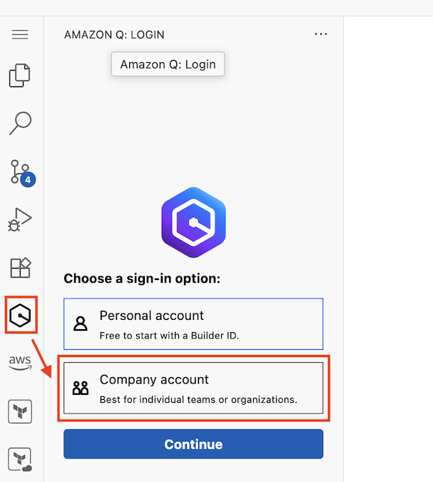

2. For the Start URL, copy the following:
    
    ```text title="Start URL"
    https://amzn.awsapps.com/start
    ```
    
    For the Region, **you MUST use us-east-1**. 
    
    Then click **Continue**. 

3. At the prompt, click **Proceed to Browser**. When another prompt replaces it and asks "Do you want code-server to open the external website?", click **Open**. 

4. A browser tab will open displaying the **Authorization requested** page. The confirmation code should already be populated. **Choose Confirm and continue**.

5. A browser tab will open displaying the **Allow Amazon Q extension for Visual Studio Code to access your data?** page. Choose **Allow access**.

    You can close that browser tab and navigate back to VS Code. If you have already authenticated into other AWS tools using IAM, you will be asked whether you want to use your Builder ID for all AWS services. Choose the option that best suits your situation.
</Steps>

### Amazon Q CLI

<Steps>
1. If you are at an AWS event, Amazon Q CLI has already been setup for you. Simply run the following command to login:
   ```bash title="Amazon Q CLI Login"
   q login
   ```
2. In the wizard in the terminal, under **Select login method**, use the arrow keys to select **Use with Pro license**. 
3. When prompted for the Start URL, copy the following:
    
    ```text title="Start URL"
    https://amzn.awsapps.com/start
    ```
    
    For the Region, **you MUST enter us-east-1**. 

4. Copy the code in under the section that reads **Confirm the following code in the browser**. It should be in the format of `ABCD-EFGH`. Then copy the link and paste into a new tab to open it in the browser.
5. When prompted with "Authorization requested," click **Confirm and continue**. 
6. When prompted with "Allow Amazon Q Developer for command line to access your data?", just click **Allow access**. When returning back to your terminal, it should say **Logged in successfully**.
7. To start a q chat session, run the following command. You should see an output that reads **Amazon Q**:
    ```bash title="Amazon Q CLI Start Chat"
    q chat
    ```

    
</Steps>

## Setting up Cline

In addition to the prerequisites in [Setup your own development environment](/dev-env/development-environment-setup), you may want to install the [Cline extension](https://cline.bot/) in a supported IDE if you're using your own account. **If you are at an AWS-sponsored event, the Cline extension will already be installed in the environment provided to you.**

For either situation, **you must link your Cline extension to Amazon Bedrock** in your account using either AWS Access Keys or an AWS profile.

<Steps>
1. Click on the Cline extension in your IDE, find the settings icon and click on it if the extension has not automatically defaulted to the settings screen.

2. For the API provider, select "Use Your Own API Key", then select Amazon Bedrock.
    
    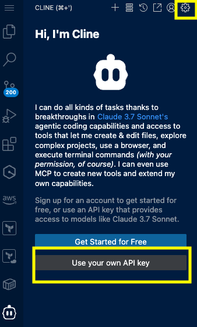

3. For those at an AWS event with an account provided by AWS, you will be provided with an AWS Access Key, AWS Secret Key, and AWS Session Token. **They will default in VS code-server, so you don't have to fill anything in for them, even if they're blank**. If you are setting your own development environment, you can either use a AWS Profile or pass in your AWS credentials.

    - For AWS Region, select us-west-2. 
    - Select the check boxes for "use cross-region inference" and "use prompt caching." 
    - Select the foundational model you'd like to use in your coding assistant. 
    - Afterwards, click the _Let's Go_ button. 
    
    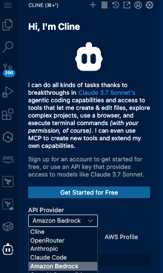
    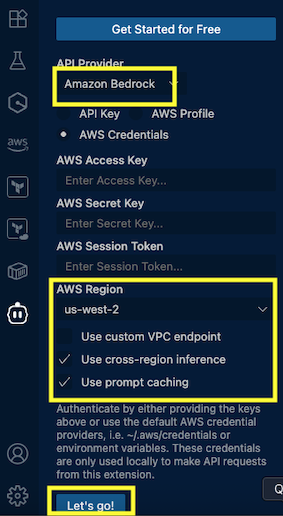

4. If using your own account, either enter your credentials or an AWS profile you have created. You will need to ensure that the role you are using has the required security to access Amazon Bedrock and any other service used in this workshop. Select the region you are using for the workshop (we recommend us-west-2 or us-east-1, as that is where we have tested this workshop). Select the check boxes for *"use cross-region inference"* (if you have Amazon Bedrock enabled in multiple regions) and "use prompt caching." Select the foundational model you'd like to use in your coding assistant. Afterwards, click the _Let's Go_ button. 

5. Ensure you disable `Allow anonymous error and usage reporting` in Cline settings. To do this, click the settings icon for Cline, and uncheck the box, then click **Save.**

    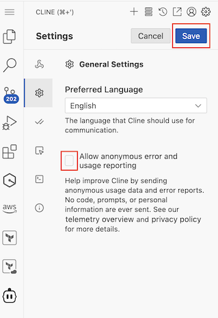
</Steps>

## Setting up Kiro IDE

Kiro is currently in Public Preview, and access to the IDE might be limited. If you are able to, follow their [installation guide](https://kiro.dev/docs/getting-started/installation/), make sure to sign-in using your preferred authentication method.

## Configuring MCP Servers

<Aside type="caution" title="Configure Only Your Chosen Tool">
The sections below provide MCP configuration for **Amazon Q**, **Cline**, and **Kiro**. 

**You only need to configure MCP servers for the ONE AI assistant you chose above.** Skip the sections for tools you're not using.

Jump to your chosen tool:
- If you're using Amazon Q → [Configuring MCP Servers in Amazon Q](#configuring-mcp-servers-in-amazon-q)
- If you're using Cline → [Configuring MCP Servers in Cline](#configuring-mcp-servers-in-cline)
- If you're using Kiro → [MCP Servers in Kiro](#mcp-servers-in-kiro)
</Aside>

### Configuring MCP Servers in Amazon Q

With Amazon Q Developer, MCP severs are configured by creating and modifying a file named `mcp.json` located at `~/.aws/amazonq/mcp.json` (Mac/Linux) or `%USERPROFILE%\.aws\config` (Windows). 

<details>
<summary>For your convenience, you can simply copy the contents for this file by expanding this section</summary>
```json title="mcp.json"
{
    "mcpServers": {
        "aws-knowledge-mcp-server": {
            "command": "uvx",
            "args": [
                "mcp-proxy",
                "--transport",
                "streamablehttp",
                "https://knowledge-mcp.global.api.aws"
            ]
        },
        "awslabs.aws-api-mcp-server": {
            "command": "uvx",
            "args": [
                "awslabs.aws-api-mcp-server@latest"
            ],
            "env": {
                "AWS_REGION": "us-west-2"
            },
            "transportType": "stdio"
        },
        "awslabs.aws-iac-mcp-server": {
            "autoApprove": [
                "read_cdk_documentation_page"
            ],
            "disabled": false,
            "timeout": 60,
            "command": "uvx",
            "args": [
                "awslabs.aws-iac-mcp-server@latest"
            ],
            "env": {
                "FASTMCP_LOG_LEVEL": "ERROR"
            },
            "transportType": "stdio"
        },
        "awslabs.aws-pricing-mcp-server": {
            "autoApprove": [],
            "disabled": false,
            "command": "uvx",
            "args": [
                "awslabs.aws-pricing-mcp-server@latest"
            ],
            "env": {
                "FASTMCP_LOG_LEVEL": "ERROR"
            },
            "transportType": "stdio"
        },
        "awslabs.aws-diagram-mcp-server": {
            "autoApprove": [],
            "disabled": false,
            "command": "uvx",
            "args": [
                "awslabs.aws-diagram-mcp-server"
            ],
            "env": {
                "FASTMCP_LOG_LEVEL": "ERROR"
            },
            "transportType": "stdio"
        },
        "awslabs.frontend-mcp-server": {
            "autoApprove": [],
            "disabled": false,
            "command": "uvx",
            "args": [
                "awslabs.frontend-mcp-server@latest"
            ],
            "env": {
                "FASTMCP_LOG_LEVEL": "ERROR"
            },
            "transportType": "stdio"
        },
        "awslabs.syntheticdata-mcp-server": {
            "autoApprove": [],
            "disabled": false,
            "command": "uvx",
            "args": [
                "awslabs.syntheticdata-mcp-server@latest"
            ],
            "env": {
                "FASTMCP_LOG_LEVEL": "ERROR"
            },
            "transportType": "stdio"
        },
        "awslabs.code-doc-gen-mcp-server": {
            "autoApprove": [],
            "disabled": false,
            "command": "uvx",
            "args": [
                "awslabs.code-doc-gen-mcp-server@latest"
            ],
            "env": {
                "FASTMCP_LOG_LEVEL": "ERROR"
            },
            "transportType": "stdio"
        },
        "awslabs.nova-canvas-mcp-server": {
            "command": "uvx",
            "args": [
                "awslabs.nova-canvas-mcp-server@latest"
            ],
            "env": {
                "AWS_REGION": "us-east-1",
                "FASTMCP_LOG_LEVEL": "ERROR"
            },
            "disabled": false,
            "autoApprove": []
        }
    }
}
```
</details>

After you copied and save the contents of your `mcp.json` file, you can verify the all the MCP Servers have been configured, follow the sections below.

### Verifying MCP Servers in Amazon Q IDE

<Steps>
1. Click on the 'Configure MCP servers' button at the top of the chat tab (a wrench and screwdriver icon like 🛠️) bar. This will bring up the list of MCP servers currently configured.

2. Take a look on the left sidebar under MCP Servers This should show a list of MCP servers with a green check mark to show that they were installed successfully.

    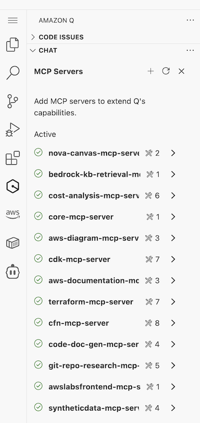

3. If the list is empty, click the refresh button. You should start to see the servers start to load one by one, until they all have a check mark next to them.
    
    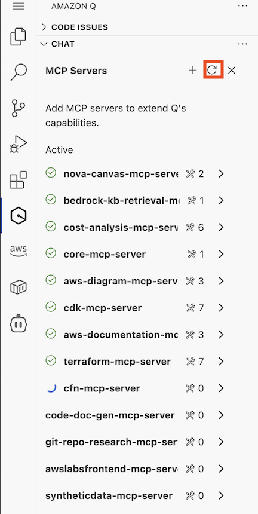

4. In the chat window, you will see an icon at near the bottom right (top right of the prompt box) that looks like a checklist, click the icon and then click *"create a new rule"*. Enter a name for your new rule such as "rule1". This will open a new tab in VS Code-Server with a file of that name.

    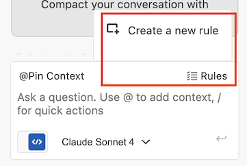 
    
    Copy and paste the following into the file: 

    ```text title="Rule for Q"
    "When developing AWS Applications, leverage the following MCP Servers: 
    - AWS Knowledge MCP Server (aws-knowledge-mcp-server) to retrieve up to date documentation of AWS services
    - AWS API MCP Server (awslabs.aws-api-mcp-server) to interact with AWS services and resources through AWS CLI commands
    - AWS IaC MCP Server (awslabs.aws-iac-mcp-server) to build AWS infrastructure as code applications
    - AWS Pricing MCP Server (awslabs.aws-pricing-mcp-server) for AWS service pricing information and cost estimation capabilities
    - AWS Diagram MCP Server (awslabs.aws-diagram-mcp-server) to generate architecture diagrams from code and infrastructure descriptions
    - AWS Frontend MCP Server (awslabs.frontend-mcp-server) for developing modern react-based frontend applications using AWS Amplify, other AWS services, and additional web technologies
    - AWS Synthetic Data MCP Server (awslabs.syntheticdata-mcp-server) to create realistic test data sets based on specified schemas and patterns
    - AWS Code Documentation MCP Server (awslabs.code-doc-gen-mcp-server) to automatically analyze a repository structure and generate comprehensive documentation for code projects
    - AWS Nova Canvas MCP Server (awslabs.nova-canvas-mcp-server) to generate images using the Amazon Nova Canvas model
    "
    ```
    Make sure to save the file when you're done.
    
</Steps>

<Aside type="caution" title="Troubleshooting">
<Steps>
1. If you don't see the **Configure MCP servers** gear/wrench icon, follow these steps:

    - After logging in with AWS Builder ID, run the following command:

            ```bash title="Removing Amazon Q cache"
            rm -rf ~/.cache/aws/toolkits/language-servers/AmazonQ/
            ```

    - Next, reload the web page. After a few seconds the button should appear.


    If it still does not appear, you need to reinstall the extension.

2. If your list of MCP servers is empty, ask your code assistant to copy over the list of mcp servers from `~/.aws/amazonq/mcp.json` into the `mcpServers` section of the `.aws/amazonq/agents/default.json` file. Alternatively, you can also copy/paste it yourself.
</Steps>
</Aside>

#### Verifying MCP Servers in Amazon Q CLI

<Steps>
1. Run `q chat` on your **VS Code-Server terminal** to start a chat session and force a reload your configured MCP servers from the `mcp.json` file. The first time you load the MCP servers it may take a while.

    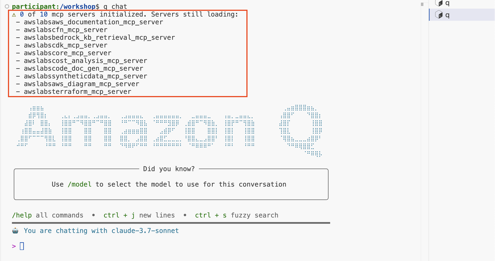

2. Within a chat session in Amazon Q CLI, you can also run the `/mcp` slash command to see the status of the MCP servers, including if they have finished loading or not. It can take some time to load the servers for the first time. Relevant information is cached, so subsequent chat sessions should load these more quickly.

    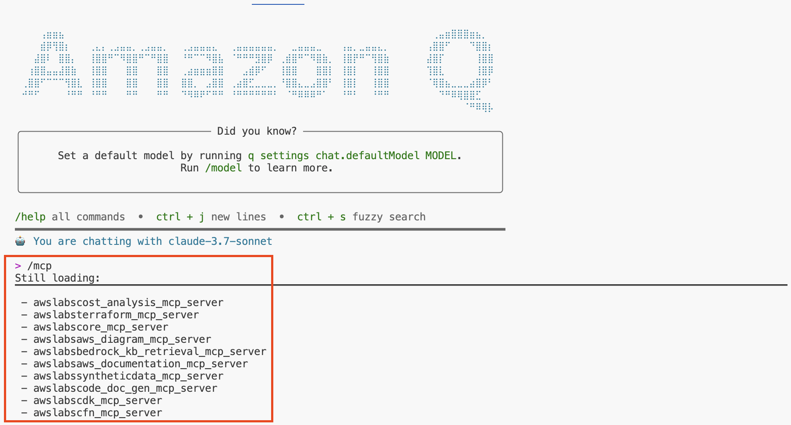

    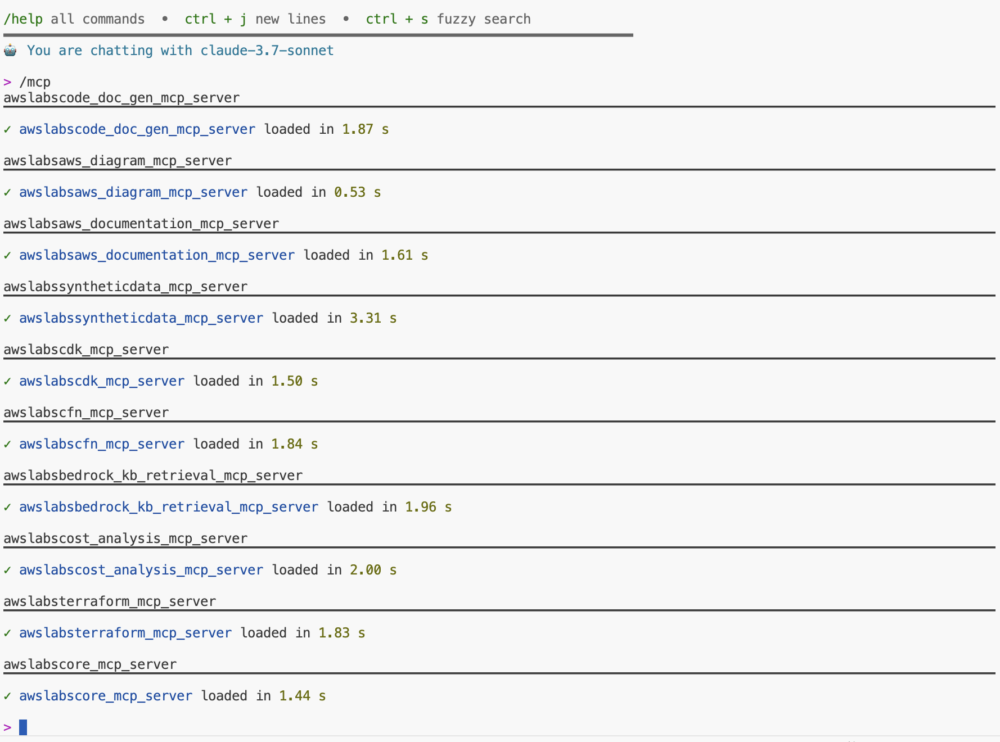
</Steps>

### Configuring MCP Servers in Cline

To set up the AWS MCP servers in Cline, you can follow [these instructions](https://docs.cline.bot/mcp/configuring-mcp-servers) to do it manually. Alternatively, Cline stores MCP servers configuration in a file called `cline_mcp_settings.json`, follow these [instructions to access the file](https://docs.cline.bot/mcp/configuring-mcp-servers#editing-mcp-settings-files).

<details>
<summary>For your convenience, you can simply copy the contents for this file by expanding this section</summary>

```json title="cline_mcp_settings.json"
{
    "mcpServers": {
        "aws-knowledge-mcp-server": {
            "command": "uvx",
            "args": [
                "mcp-proxy",
                "--transport",
                "streamablehttp",
                "https://knowledge-mcp.global.api.aws"
            ]
        },
        "awslabs.aws-api-mcp-server": {
            "command": "uvx",
            "args": [
                "awslabs.aws-api-mcp-server@latest"
            ],
            "env": {
                "AWS_REGION": "us-west-2"
            },
            "transportType": "stdio"
        },
        "awslabs.aws-iac-mcp-server": {
            "autoApprove": [
                "read_cdk_documentation_page"
            ],
            "disabled": false,
            "timeout": 60,
            "command": "uvx",
            "args": [
                "awslabs.aws-iac-mcp-server@latest"
            ],
            "env": {
                "FASTMCP_LOG_LEVEL": "ERROR"
            },
            "transportType": "stdio"
        },
        "awslabs.aws-pricing-mcp-server": {
            "autoApprove": [],
            "disabled": false,
            "command": "uvx",
            "args": [
                "awslabs.aws-pricing-mcp-server@latest"
            ],
            "env": {
                "FASTMCP_LOG_LEVEL": "ERROR"
            },
            "transportType": "stdio"
        },
        "awslabs.aws-diagram-mcp-server": {
            "autoApprove": [],
            "disabled": false,
            "command": "uvx",
            "args": [
                "awslabs.aws-diagram-mcp-server"
            ],
            "env": {
                "FASTMCP_LOG_LEVEL": "ERROR"
            },
            "transportType": "stdio"
        },
        "awslabs.frontend-mcp-server": {
            "autoApprove": [],
            "disabled": false,
            "command": "uvx",
            "args": [
                "awslabs.frontend-mcp-server@latest"
            ],
            "env": {
                "FASTMCP_LOG_LEVEL": "ERROR"
            },
            "transportType": "stdio"
        },
        "awslabs.syntheticdata-mcp-server": {
            "autoApprove": [],
            "disabled": false,
            "command": "uvx",
            "args": [
                "awslabs.syntheticdata-mcp-server@latest"
            ],
            "env": {
                "FASTMCP_LOG_LEVEL": "ERROR"
            },
            "transportType": "stdio"
        },
        "awslabs.code-doc-gen-mcp-server": {
            "autoApprove": [],
            "disabled": false,
            "command": "uvx",
            "args": [
                "awslabs.code-doc-gen-mcp-server@latest"
            ],
            "env": {
                "FASTMCP_LOG_LEVEL": "ERROR"
            },
            "transportType": "stdio"
        },
        "awslabs.nova-canvas-mcp-server": {
            "command": "uvx",
            "args": [
                "awslabs.nova-canvas-mcp-server@latest"
            ],
            "env": {
                "AWS_REGION": "us-east-1",
                "FASTMCP_LOG_LEVEL": "ERROR"
            },
            "disabled": false,
            "autoApprove": []
        }
    }
}
```
</details>

After you copied and save the contents of your `cline_mcp_settings.json` file, you can verify the all the MCP Servers have been configured, follow the section below.

#### Verifying MCP Servers in Cline

<Steps>
1. In the Cline extension, you will see a line of 3 horizontal bars (the "hamburger" icon) in the settings control bar near the top of your IDE. Clicking this and then the "Installed" tab will reveal the MCP Servers installation window. 
    
    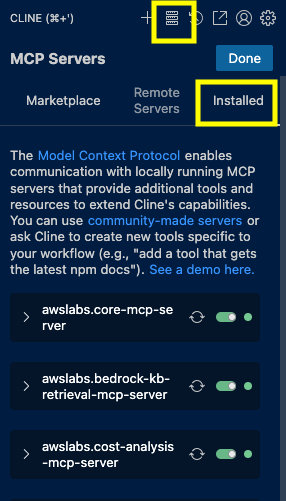

2. In the Cline extension, you will see an icon at the bottom (under the prompt box) that looks like a set of scales. Hovering over this reveals that it is meant to "Manage Cline Rules and Workflows." Click on the icon. Press the "+" sign in the Global rules field and enter a name for your new rule such as "rule1". This will open a new tab in VS Code-Server with a file of that name. Copy and paste the following into the file: 

    ```text title="Rule for Cline"
    "When developing AWS Applications, leverage the following MCP Servers: 
    - AWS Knowledge MCP Server (aws-knowledge-mcp-server) to retrieve up to date documentation of AWS services
    - AWS API MCP Server (awslabs.aws-api-mcp-server) to interact with AWS services and resources through AWS CLI commands
    - AWS IaC MCP Server (awslabs.aws-iac-mcp-server) to build AWS infrastructure as code applications
    - AWS Pricing MCP Server (awslabs.aws-pricing-mcp-server) for AWS service pricing information and cost estimation capabilities
    - AWS Diagram MCP Server (awslabs.aws-diagram-mcp-server) to generate architecture diagrams from code and infrastructure descriptions
    - AWS Frontend MCP Server (awslabs.frontend-mcp-server) for developing modern react-based frontend applications using AWS Amplify, other AWS services, and additional web technologies
    - AWS Synthetic Data MCP Server (awslabs.syntheticdata-mcp-server) to create realistic test data sets based on specified schemas and patterns
    - AWS Code Documentation MCP Server (awslabs.code-doc-gen-mcp-server) to automatically analyze a repository structure and generate comprehensive documentation for code projects
    - AWS Nova Canvas MCP Server (awslabs.nova-canvas-mcp-server) to generate images using the Amazon Nova Canvas model
    "
    ```
    Make sure to save the file when you're done.

    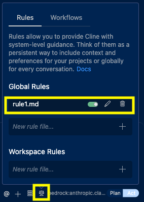

3. At the bottom of the Cline extension pane, toggle Cline to "Plan" mode. Plan mode allows the LLM to explain what it will do without making any changes to your code or environment. If you want to test that the extension is working correctly with Amazon Bedrock, simply type "hi" in the box where it says "Type your task here..." You should get a response via Bedrock.
    
    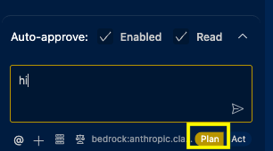

4. Just above the prompt window, there is a menu that says "Auto-approve." Click on the up arrow on the left of that menu to see your options. Change the "Max Requests" to 50. Make sure to select the checkbox next to "Use MCP Servers."
    
    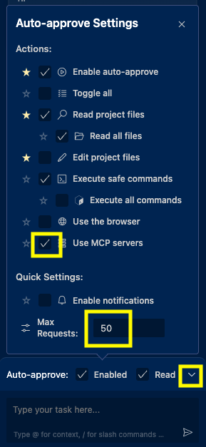
</Steps>

### MCP Servers in Kiro

To configure MCP Servers in the Kiro IDE, you must follow [this guide](https://kiro.dev/docs/mcp/#setting-up-mcp).


## Next Steps

Once you get your development environment ready and your IDE extensions fully configured, you can read the workshop overview to know about the activities you'll be working on.

<LinkCard title="Workshop Overview" href="/workshop/overview" />
